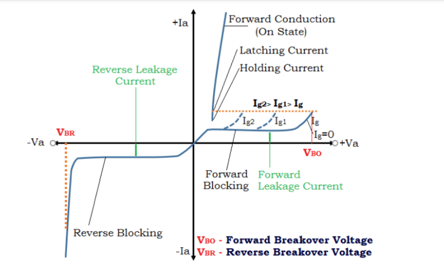
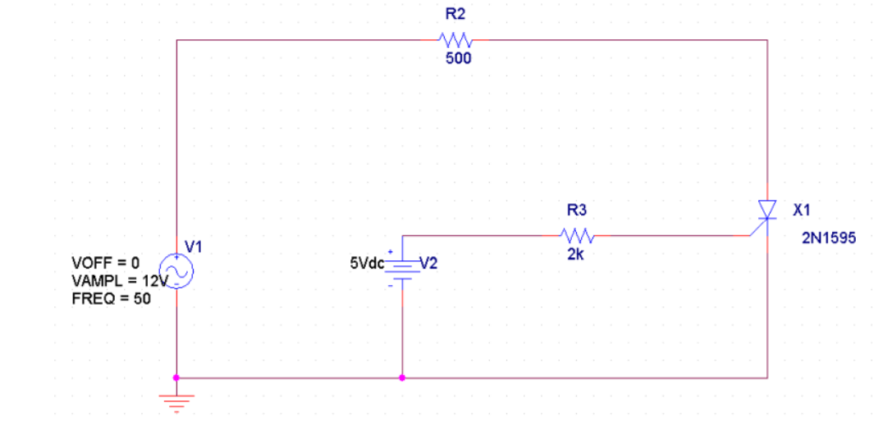

# EXPERIMENT 1

## OBJECTIVE
To obtain the characteristics of SCR Using PSPICE/LTSPICE simulation software and obtain the values of latching and holding current.

## SOFTWARE REQUIRED
PSPICE/LTSPICE

## DEVICES USED
SCR 2N1595

## THEORY
When Anode is positive with respect to the cathode, SCR is said to be forward biased.
Whenever the applied voltage becomes more than the Forward Breakover Voltage (VBO),
SCR starts conducting. By giving a suitable triggering pulse to the gate, the SCR can be made
to conduct at a lower anode to cathode voltage. When the SCR is reverse biased it acts as
an open circuit upto Reverse Breakdown voltage after which the SCR breaks down. Latching
current is the minimum value of anode current which it must attain during turn-on process
to maintain conduction when gate signal is removed. Holding current is defined as the
minimum value of anode current below which SCR turns off. The expected outcome is
shown below: Here markings are shown for latching and holding current values with
forward breakover voltage and this would help afterwards to get values for each markings.

## PROCEDURE
+ Make the connections as per the schematic and fix the value of V1 and V2 at min
level
+ Set the value of gate current to 2mA by adjusting the values of V2 and R2
+ Give a sinusoidal voltage of 30V at 50Hz and run the simulation for 20ms
+ Obtain the characteristics of SCR with anode to cathode voltage on x-axis and anode
current on y-axis and analyse
	+ forward blocking mode
	+ forward conduction mode
	+ reverse blocking mode

## SCHEMATIC

## OBSERVATION

## RESULT
According to the result we obtained, our observation successfully satisfies the VI
Characteristics of SCR in forward region, here other than obtaining the required graph we
also obtained\:

**Latching Current**: 11.3mA

**Holding Current**: Less than 5mA

**Forward breakover voltage**: 1.58V
