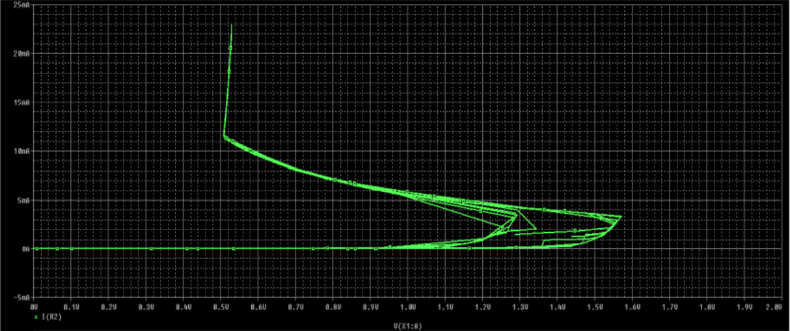

# EXPERIMENT 2

## OBJECTIVE
To obtain the output and transfer characteristics of MOSFET Using LTSPICE
simulation software.

## SOFTWARE REQUIRED
PSPICE/LTSPICE

## DEVICES USED
MOSFET IRF150

## THEORY
A power MOSFET has three terminals called drain, source and gate. MOSFET is a voltagecontrolled device. As its operation depends upon the flow of majority carriers only, MOSFET
is a unipolar device. The control signal, or gate current is lesser than a BJT. This is because
of fact that gate circuit impedance in MOSFET is extremely high. This large impedance
permits the MOSFET gate to be driven directly from microelectronic circuits. Power
MOSFET’s are now finding increasing applications in low power high frequency converters.
Power MOSFET’s are of two types; n-channel enhancement MOSFET and p-channel
enhancement MOSFET. Out of these two types, n-channel enhancement MOSFET is more
common because of higher mobility of electrons.
On p-substrate (or body), two heavily doped n+ regions are diffused as shown. An insulating
layer of silicon dioxide (Sio2) is grown on the surface. Now this insulating layer is etched in
order to embed metallic source and drain terminals. Note that n+ regions make contact
with source and drain terminals as shown. A layer of metal is also deposited on SiO2 layer
so as to form the gate of MOSFET.

## PROCEDURE
Make the connections as shown in the schematic

## SCHEMATIC

## OBSERVATION

## RESULT
According to the result we obtained, our observation successfully satisfies the VI
Characteristics of SCR in forward region, here other than obtaining the required graph we
also obtained:
**Latching Current**: 11.3mA
**Holding Current**: Less than 5mA
**Forward breakover voltage**: 1.58V
