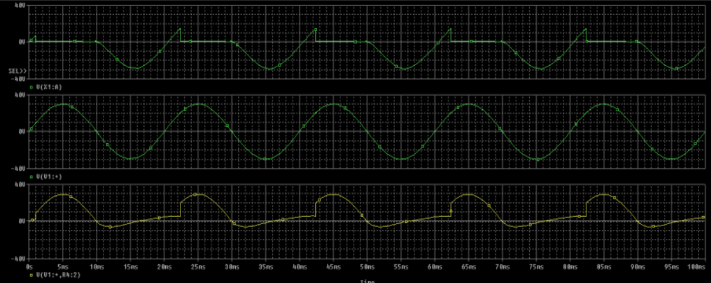
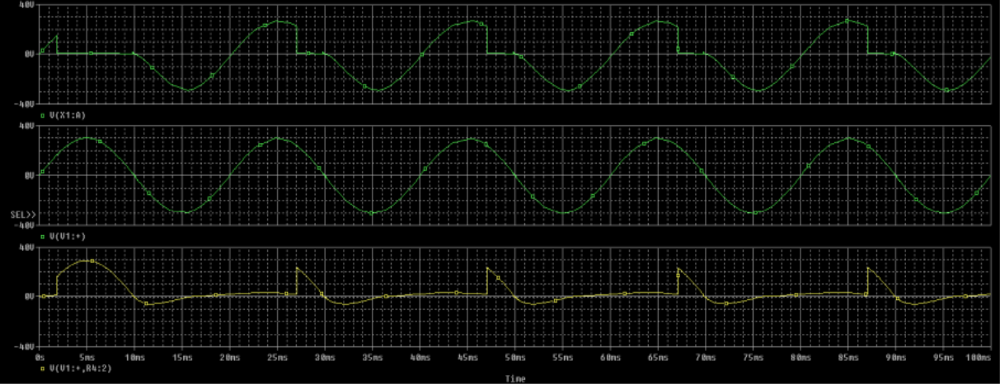

# EXPERIMENT 3

## OBJECTIVE
To simulate the RC firing circuit of SCR with LTSPICE/PSPICE Simulation software

## SOFTWARE REQUIRED
PSPICE/LTSPICE

## DEVICES USED
+ Diode D1D2-1N4002
+ SCR Q2-2N1595

## THEORY
The conversion of SCR state from OFF state to ON state may be done in several ways

* Forward voltage triggering
* $\frac{dv}{dt}$ triggering
* Temperature triggering
* Light triggering
* Gate triggering

Among all the method of triggering the SCRs, gate triggering is the most commonly used to turn on the device as this method accurately tends itself for turning on the SCR whenever the device is in need of conduction state. Gate triggering is not only efficient but also a reliable method. Here, diode D1-D4 form a full wave bridge. Full wave output voltage may be obtained by using RC full wave trigger circuit. Initially, the capacitor C charges to a low positive value which is almost zero. The capacitor is set to this minute positive voltage with upper plate positive and lower plate negative by the SCR gates clamping action. SCR gates triggered only when it reaches a voltage of about Egt, and the rectified voltage appears across load. Vd appears across load as E0. The value of RC may be calculated by using the empirical formula as follows

> RC $\leqslant$ 50 $\frac{T}{2}$ 157 $\omega$

> Value of R is given as: R << $\frac{(Es – Egt)}{Igt}$

## SCHEMATIC

__Schematic__

## OBSERVATION

__Firing Angle 45$^{\circ}$__

__Firing Angle 120$^{\circ}$__

In both of the observation

- **Top Row** is Thyristor Voltage
- **Middle Row** is Sending Voltage
- **Last Row** is Load Voltage

## RESULT

According to the result we obtained, our observation successfully satisfies the expected range of values of R4 is 10 ohms to 2k ohms for firing angle from 0$^{\circ}$ to 180$^{\circ}$ and at 1.1k ohms we get firing angle for 90$^{\circ}$

**Firing Angle** = 45$^{\circ}$, **R4** = 350 ohms

**Firing Angle** = 120$^{\circ}$, **R4** = 1.65k ohms
