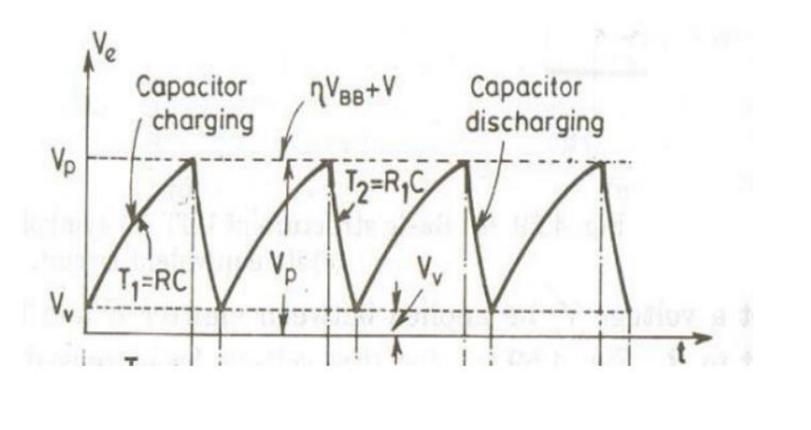
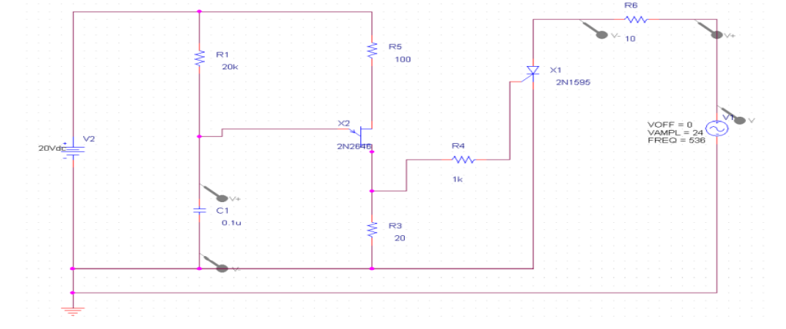
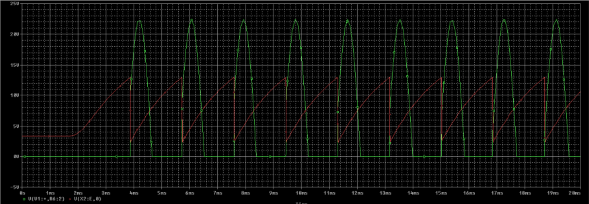
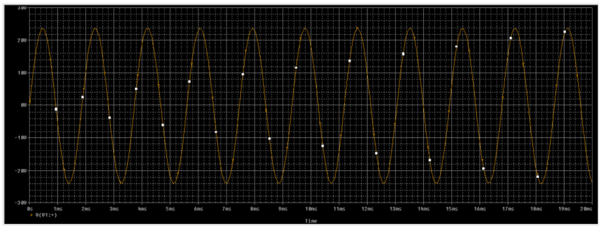
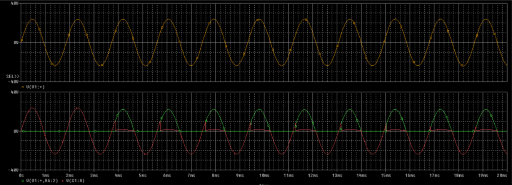

# EXPERIMENT 4

## OBJECTIVE
To simulate the **UJT firing circuit** of SCR

## SOFTWARE REQUIRED
PSPICE/LTSPICE

## DEVICES USED
+ UJT Q1-2N2646
+ SCR Q2-2N1595

## THEORY

UJT is often used as a triggering device for SCRs and TRIACs\. Here, UJT is used as a _relaxation oscillator_. The capacitor gets charged, when the supply is **ON**\. When the capacitor voltage becomes equal to the peak voltage, UJT turns on\. The capacitor discharges through the low resistance path containing $R_{B1}$ and $R_{1}$\. The pulses produced by the quick discharge of the capacitor is applied across the gate-cathode region of the SCR, to make it turn-on\. By varying the resistance $R_{c}$, the charging of the capacitor can be varied, which in turn will vary the time at which UJT turns on and which will vary the firing angle

## EXPECTED OUTCOME

## SCHEMATIC

## OBSERVATION

__Capacitor Charging and Load Voltage__

__Sending Voltage__

__Sending Voltage, Thyristor Voltage and Load voltage__

## RESULT

According to the result we obtained, our observation successfully satisfies the expected outcome for capacitive charging also the firing circuit resembles the same which is satisfied by above figure.
