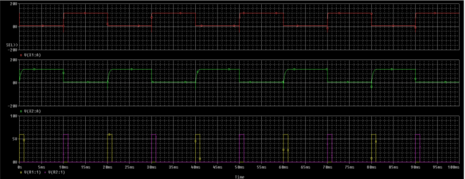

# EXPERIMENT 5

## OBJECTIVE
To study the class-C commutation and verify the output waveform using LTSPICE/PSPICE softwate

## SOFTWARE REQUIRED
PSPICE/LTSPICE

## DEVICES USED
+ SCR Q2-2N1595

## THEORY

To turn-off the thyristor (SCR) a commutation circuit is required\. Class-C commutation is also called as Complementary commutation\. As seen in schematic below, there are two thyristors in parallel, one is main and another one is auxiliary\. Initially, both the thyristors are in OFF conditions and the voltage across capacitor is also zero\. Now, as the gate pulse is applied to the main thyristor, the current will start flowing from two paths, one is from $R_{1}$-$T_{1}$ and second is $R_{2}$-C-$T_{1}$\. Hence, the capacitor also starts charging to the peak value equal to the input voltage with the polarity of plate B positive and plate A negative\.  Now, as the gate pulse is applied to the Thyristor $T_{2}$, it turns ON and a negative polarity of current appear across the Thyristor $T_{1}$ which cause $T_{1}$ to get turn OFF\. And, the capacitor starts charging with the reverse polarity\. Simply we can say that when $T_{1}$ turns ON, it turns OFF $T_{2}$ and as $T_{2}$ turns ON, it turns OFF $T_{1}$\. Application of this commutation technique is for parallel inverter, current source inverter, etc

## SCHEMATIC

    

## EXPECTED OUTCOME

    

## OBSERVATION

- $V_{4}$(Pulse Voltage)
- $V_{5}$(Pulse Voltage)
- Thyristor $X_{1}$ Voltage
- Thyristor $X_{2}$ Voltage

- Capacitive Voltage

## RESULT

According to the result we obtained, our observation successfully satisfies the expected outcome for thyristor voltage($X_{1}) and thyristor voltage($X_{2}) also the capacitance voltage satisfies the correction method
