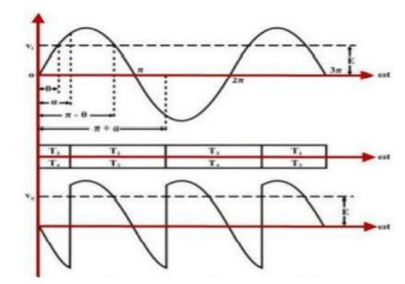
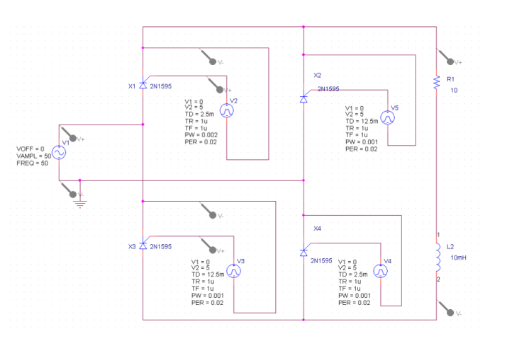
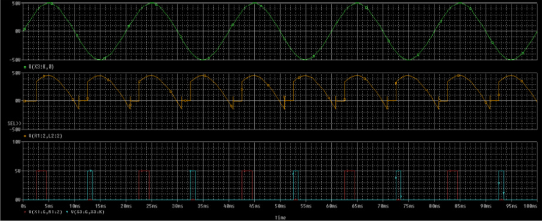

# EXPERIMENT 6

## OBJECTIVE
Single phase fully controlled bridge converter with RL load

## SOFTWARE REQUIRED
PSPICE/LTSPICE

## DEVICES USED
SCR 2N1595

## THEORY

Single phase fully controlled converters are obtained by replacing the diodes of an uncontrolled converter with thyristors. It is one of the most popular converter circuits and is widely used in the speed control of separately excited dc machines.  In a fully controlled converter, the output voltage can be controlled by controlling the firing delay angle ($\alpha$) of the thyristors. Thyristors $T_{1}$ and $T_{2}$ are fired together while $T_{3}$ and $T_{4}$ are fired 180º after $T_{1}$ and $T_{2}$. Depending on the load condition and the firing angle a fully controlled bridge converter can operate either in the continuous conduction mode or in the discontinuous conduction mode. In the continuous conduction mode, the load voltage depends only on the firing angle and not on load parameters.  In the discontinuous conduction mode, the output voltage decreases with increasing load current. However, the output voltage is always greater than that in the continuous conduction mode for the same firing angle.

## MODEL GRAPH

Single Phase Fully Controlled Bridge Converter

## SCHEMATIC

schematic

## OBSERVATION

- **Top Row** is Sending Voltage
- **Middle Row** is Load Voltage
- **Last Row** is Pulse Voltage of V2 and V3

## RESULT

According to the result we obtained, our observation successfully satisfy the expected outcome for load voltage as shown in the model graph.
